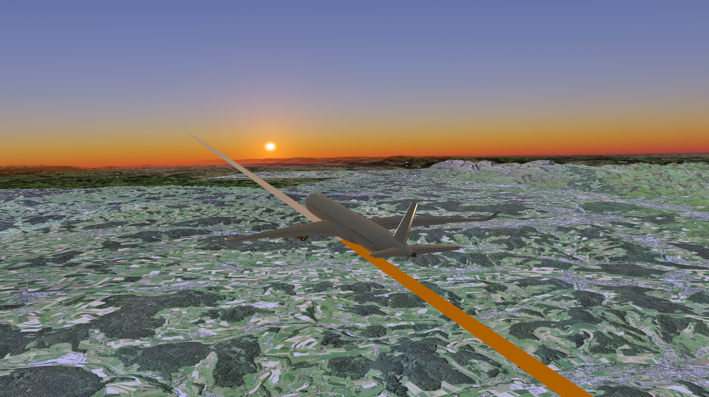

<div align="center">

# CesiumRS

**A 3D globe and flight renderer in Rust, built on wgpu.**

A WGS84 globe with streamed imagery and terrain, a physically based sky, and an offline
flight planner that turns two airports and a duration into the route an airline would fly.
It runs on desktop and on Android.



</div>

CesiumRS is the engine behind [**Blocktime**](https://github.com/silas-270/Blocktime), a
focus timer in which every study session is a real flight. That shapes its priorities: it
has to run for hours on a phone without draining it, look right at cruise altitude, and
keep working with no network at all.

## Features

**Globe**
- WGS84 ellipsoid with Web Mercator tiles, quadtree LOD and a speculative prefetcher
- Three map styles: a dark vector basemap (CARTO), satellite imagery with 3D terrain
  (Esri + Terrarium), and a **fully offline** Natural Earth map rasterised on the CPU
- Terrain relief with crack-free LOD seams, height-aware culling and occlusion behind
  mountains, and no slowdown for the flat globe when terrain is off
  ([terrain.md](docs/terrain.md))
- Visibility culling with written proofs behind it ([culling-math.md](docs/culling-math.md))
- City labels, route polylines and glTF aircraft models

**Sky and light**
- Rayleigh, Mie and ozone scattering baked into a small lookup texture: sunsets, the Belt
  of Venus and Earth's shadow, without ray marching per pixel
- Sun, moon and stars, with lighting driven by how far into the flight the aircraft is

**Flight**
- Offline flight planning with no navigation data: great-circle routes, wind-optimised
  tracks against a jet-stream climatology, closed-airspace avoidance, oceanic track grids,
  flight levels with step climbs, runway selection and field elevation
  ([flight-plan.md](docs/flight-plan.md))
- Free, tracking and cockpit cameras, with a 787 flight deck for the cockpit view
- A headless renderer that writes route maps to PNG, callable from Kotlin through a C ABI

## Getting started

Requires a recent stable Rust toolchain and a GPU with Vulkan, Metal or DX12.

```bash
git clone https://github.com/silas-270/CesiumRS.git
cd CesiumRS
cargo run --release
```

This opens the viewer with a Frankfurt–Stuttgart flight. Some variations:

```bash
cargo run --release -- --route LHR-NRT --map-style satellite-terrain
cargo run --release -- --route 1.36,103.99,51.47,-0.45     # lat,lon,lat,lon
cargo run --release -- --map-style offline                  # no network at all
cargo run --release -- --help
```

Presets: `FRA-STR`, `STR-FRA`, `LHR-CDG`, `ZRH-GVA`, `GRZ-FRA`, `JFK-LHR`, `SFO-HNL`,
`LHR-NRT`, `DXB-SYD`, `DXB-JFK`, `SIN-LHR`.

### API keys

The online map styles read their keys **at compile time**, so they never end up in source:

| Variable | Used by | Without it |
|---|---|---|
| `CARTO_API_KEY` | `standard` map style | Every tile is watermarked "API KEY REQUIRED" |
| `ESRI_API_KEY` | `satellite-terrain` map style | Falls back to Esri's keyless, non-commercial service |

```bash
CARTO_API_KEY=… ESRI_API_KEY=… cargo run --release
```

The `offline` style and the headless renderer need neither.

## Using it as a library

```rust
use cesium_flight::tracker::FlightTrackerApp;
use cesium_rs::{CameraMode, CesiumViewer, MapStyle};

fn main() {
    let (flight_app, flight) = FlightTrackerApp::with_handle();

    let viewer = CesiumViewer::builder()
        .map_style(MapStyle::SatelliteTerrain)
        .with_extension(Box::new(flight_app))
        .build();
    let camera = viewer.handle();

    // Both handles are thread-safe and non-blocking.
    std::thread::spawn(move || {
        // Frankfurt → Tokyo Haneda, compressed into a 90-minute session.
        flight.load_flight("demo", 8.57, 50.03, 139.78, 35.55, 90 * 60 * 1000, None, None, vec![]);
        flight.play();
        camera.camera_set_mode(CameraMode::Tracking);
    });

    viewer.run(); // takes over the main thread
}
```

For Android and Kotlin, see [kotlin-integration.md](docs/kotlin-integration.md).

## Project layout

```
crates/
  cesium-engine/   the renderer: wgpu state, globe, tiles, terrain, culling, sky, labels
  cesium-flight/   flight planning, telemetry, cameras, aircraft and cockpit models
src/
  api.rs           CesiumViewer / ViewerHandle, the public entry point
  headless/        C ABI for PNG route renders
  android_jni.rs   JNI bridge for the Android app
  testing/         visual harnesses, sweeps and benchmarks (behind the `testing` feature)
assets/            models, the offline world map and terrain test fixtures
docs/              one document per subsystem
tools/             data generators and on-device profiling scripts
```

## Testing

Flight planning is pure computation and is covered by ordinary unit tests:

```bash
cargo test -p cesium-flight
```

The engine's tests live in `src/testing/`. Many of them render headlessly on the GPU or
fetch real tiles, so run them by area rather than all at once:

```bash
cargo test --release --lib culling:: -- --test-threads=1   # the culling gate
cargo test --release --lib terrain::
```

Rendering changes are checked by eye: the capture harnesses in `src/testing/rendering/`
write PNGs to look at.

## Documentation

Start with [docs/README.md](docs/README.md) and [docs/architecture.md](docs/architecture.md).
Each subsystem has one document that explains what the code does and why:

| Document | Covers |
|---|---|
| [architecture.md](docs/architecture.md) | Crates, threads, the frame loop, render passes, platforms, features |
| [tiles-and-lod.md](docs/tiles-and-lod.md) | Map styles, fetching, caches, the LOD rule, fog, prefetch |
| [terrain.md](docs/terrain.md) | Height tiles, relief meshes, height-aware culling, culling behind mountains, terrain LOD |
| [culling-implementation.md](docs/culling-implementation.md), [culling-math.md](docs/culling-math.md) | Which tiles are drawn, and the proofs |
| [camera.md](docs/camera.md) | Camera modes, near plane, input, ground collision |
| [models.md](docs/models.md) | The aircraft and cockpit models |
| [lighting.md](docs/lighting.md) | Sun, moon, sky, haze and object lighting |
| [labels.md](docs/labels.md) | City labels |
| [flight-plan.md](docs/flight-plan.md), [route-line.md](docs/route-line.md) | Flight planning and the route line |
| [kotlin-integration.md](docs/kotlin-integration.md) | Using the engine from Android |
| [testing.md](docs/testing.md) | Tests and harnesses |

## License

The code is released under the [MIT License](LICENSE).

The aircraft and cockpit models are third-party work under Creative Commons licenses; see
[MODEL_LICENSES.md](MODEL_LICENSES.md). Map data: offline map from
[Natural Earth](https://www.naturalearthdata.com) (public domain); standard basemap ©
[CARTO](https://carto.com/attribution/), © [OpenStreetMap](https://www.openstreetmap.org/copyright)
contributors; satellite imagery by [Esri](https://www.esri.com); elevation from
[Terrain Tiles](https://github.com/tilezen/joerd/blob/master/docs/attribution.md) on AWS.
