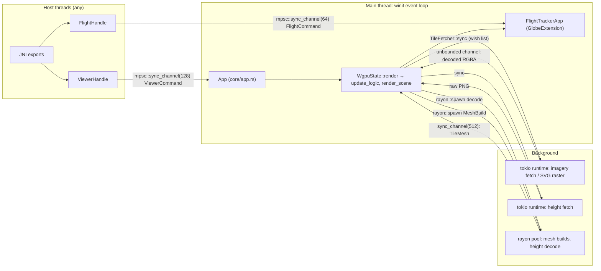

# Architecture

How the pieces of CesiumRS fit together: the crates, who owns which thread, what happens
in one frame, and where desktop and Android part ways. Each subsystem named here has its
own document; this one is the map between them.

## The workspace

| Crate | Path | What it is |
|---|---|---|
| `cesium-engine` | `crates/cesium-engine` | The renderer. wgpu device and surface, the tile quadtree and its culling, imagery and terrain streaming, the sky, labels, and generic glTF and polyline pipelines. Knows nothing about flights. |
| `cesium-flight` | `crates/cesium-flight` | The flight: the offline planner (`telemetry/`), the `FlightTrackerApp` extension that draws the route and the aircraft and drives the cameras, the A350 and 787 cockpit models, route presets and a small airport database. |
| `cesium_rs` | `src/` | The public API (`CesiumViewer`, `ViewerHandle`, `MapStyle`), the desktop binary `cesium_app` (`src/main.rs`), the C ABI for headless renders (`src/headless/`), the JNI bridge (`src/android_jni.rs`) and the test harnesses (`src/testing/`). Built as both `rlib` and `cdylib` (`libcesium_rs.so`). |

The dependency direction is strict: `cesium_rs → cesium-flight → cesium-engine`. The
engine is extended, never edited, to add a use case; everything flight-specific enters it
through one trait.

## The engine/extension split

`GlobeExtension` (`crates/cesium-engine/src/core/extension.rs`) is the whole contract
between the globe and whatever is drawn on it:

| Method | When | What the flight app does with it |
|---|---|---|
| `init` | once, after the device exists | Loads the A350 model, builds any flights queued before start-up |
| `sample_ground` | every frame, before `update` | Receives the engine's ground query (terrain height above the ellipsoid under an ECEF point) and fits the aircraft and the route line onto the drawn terrain near the airports (`terrain_fit.rs`) |
| `update` | every frame | Drains `FlightCommand`s, advances playback, publishes telemetry, positions the camera for the current mode |
| `render` | every frame, in the scene pass after globe and sky | The route ribbon (the "world layer") |
| `render_foreground` | every frame, after the city labels | The aircraft or the cockpit interior, so a model nearer than a label's anchor covers it |
| `runway_corridors` | every frame, terrain on | Runway rectangles the terrain is flattened along |
| `snapshot_for_headless` | on a 4K screenshot | A copy of the extension's state for an offscreen render |
| `render_ui` | debug panel only | The flight controls in the egui window |

The extension is handed `&mut Camera` in `update`, which is how the flight app owns the
camera in Tracking and Cockpit mode without the engine knowing what a cockpit is.

## Threads and channels

Everything that touches the GPU or the quadtree runs on the thread that runs the winit
event loop. Other threads talk to it only through bounded channels, and every public
handle method is a `try_send`: a host thread never blocks on the renderer, and a full
channel drops the command rather than stalling a UI thread.

- **`CesiumViewer::handle()` → `ViewerHandle`** (`src/api.rs`) sends `ViewerCommand`s
  (`core/command.rs`): camera position, mode, anchor, zoom and pitch; map grading;
  imagery URL or source mode (each carrying the style's imagery depth cap, so the two
  can never land a frame apart); terrain on/off. `App::about_to_wait` drains the queue
  at the start of every frame.
- **`FlightTrackerApp::with_handle()` → `FlightHandle`** (`crates/cesium-flight/src/flight_handle.rs`)
  sends `FlightCommand`s: load a flight, plan configuration, route-line mode, progress,
  speed, play/pause. The extension drains them in `update`, so they apply in order in
  the same frame as the engine's own commands.
- **Telemetry flows back** through shared `Arc<Mutex<…>>` slots the extension writes each
  frame (`current_telemetry`, `current_camera_state`) and the JNI bridge reads.
- **Imagery** is fetched on a dedicated multi-thread tokio runtime owned by the
  `TileFetcher`, at most 16 requests in flight, with PNG decoding on tokio's blocking
  pool. **Heights** use a second `TileFetcher` and runtime; their Terrarium decode runs
  on rayon. **Meshes** are built on rayon from inputs sampled on the main thread. See
  [tiles-and-lod.md](tiles-and-lod.md) and [terrain.md](terrain.md).

## One frame

`WgpuState::render` (`crates/cesium-engine/src/render/wgpu_state.rs`) is one frame. Its
update half, `update_logic`, runs in this order, and the order is load-bearing:

1. **Ground under the camera.** `TileSystem::ground_height_at` samples the resident
   height data under the eye, and `Camera::set_ground_height` stores it. The near plane
   is derived from height above the ground, and the culling frustum and the drawn
   frustum must be built from the same value.
2. **Extension.** Runway corridors are pushed to the height manager (a change clears the
   mesh cache so the ground is rebuilt flattened), `sample_ground` hands the extension
   the ground query, and `update` lets it move the camera.
3. **Collision.** With terrain on, `Camera::enforce_bounds_with` keeps the camera above the
   ground at every position it tests; the ground points it will need next frame are
   registered with `want_ground_at` (for Tracking, a ring of the orbit and the line of
   sight to the aircraft). The ground height and the frustum are then recomputed for the
   final camera.
4. **One camera-relative `Frustum`** (four side-plane normals, the f64 eye, the eight
   corners), shared by the quadtree and the labels so the two cannot disagree.
5. **Quadtree.** `set_frame_params` derives this frame's `lod_factor` and fog density;
   `set_terrain_lod` the geometric LOD term; `refresh_height_bounds` tightens every
   node's height interval from newly arrived data; `refresh_terrain_horizon` builds the
   occlusion march; `update` culls and refines. Terrain-only steps are no-ops on the flat
   arm. See [culling-implementation.md](culling-implementation.md).
6. **Labels.** `LabelManager::update` picks the visible city labels ([labels.md](labels.md)).
7. **Camera uniform** is written (matrices, camera position, sun and moon).
8. **Meshes.** `build_missing_meshes_now` builds, within 3 ms, the ancestors of visible
   tiles and then the nearest visible tiles on this thread; `get_renderable_tiles` then
   picks, per branch, the visible tiles or the nearest ancestor that has a mesh.
9. **Streaming.** Missing and stale meshes are queued, `TileSystem::update` sends this
   frame's imagery and height wish lists, uploads at most 30 textures (2 ms budget) and
   48 finished meshes.
10. **Display state.** Each drawn tile is assigned a texture, its own or an ancestor's,
    under the no-downgrade rules of `update_display_state`.

The render half, `render_scene`, is one render pass after the sky LUT pass:

| Order | Draw | Depth | Notes |
|---|---|---|---|
| 0 | Sky LUT pass (separate pass, 128×98 target) | — | Rendered every frame; see [lighting.md](lighting.md) |
| 1 | Globe tiles, near to far | test `Greater`, write | Reverse-Z, cleared to 0. One draw per tile, push constants carry the camera-relative tile centre and the texture's UV window |
| 2 | Debug geometry (debug panel only) | | Frustum and tile crosshairs in God-camera mode |
| 3 | Sky, one full-screen triangle at z = 0 | `GreaterEqual`, no write | Covers only pixels no tile wrote |
| 4 | `GlobeExtension::render` (route ribbon) | test, write | |
| 5 | City labels | compare `Always`, write anchor depth | Cover the world layer, but not a model nearer than their anchor |
| 6 | `GlobeExtension::render_foreground` (aircraft or cockpit) | test, write | |
| 7 | egui debug panel (desktop, `debug_panel`) | separate pass | |

The globe is drawn in a **camera-relative** frame: vertex positions are f32 offsets from
a per-tile f64 centre, and the shader adds the tile centre minus the f64 camera position
(computed on the CPU in f64, then narrowed). No world position larger than a tile ever
reaches f32. The polyline does the same with split high/low f32 pairs.

## Units and frames

- **Length: megametres** (1 unit = 1 000 km) everywhere in the engine. Metres appear only
  at stated boundaries (Terrarium samples, fog constants, `lon_lat_alt_to_ecef_f64`'s
  altitude argument, the flight planner) and are converted there.
- **ECEF is Y-up with negated Z**: `(a·cosφ·cosλ, b·sinφ, −a·cosφ·sinλ)`
  (`globe::geometry::lon_lat_to_ecef_f64`). The polar axis is +Y and the semi-minor axis
  `b` sits in the *y* component.
- **Latitude in that formula is the engine's tiling latitude**, not geodetic latitude:
  `φ` is the angle that names a Web Mercator tile row, and a point placed with it lies on
  the ellipsoid but its surface normal is not at `φ` (they differ by up to 0.19° at 45°).
  `ecef_to_lon_lat_f64` is the exact inverse of this mapping, and anything that round
  trips through the tiling uses it.
- **Reverse-Z** projection: near maps to 1, far to 0; depth cleared to 0, tested with
  `Greater`.

## Platforms

| | Desktop | Android |
|---|---|---|
| Entry point | `CesiumViewer::run()` (from `src/main.rs` or a host program) | `android_main` in `src/lib.rs`, launched by `GameActivity` |
| Engine config | Built by `CesiumViewerBuilder::build` from the builder's settings | `TileEngineConfig::default()` — the builder's config is built but not used |
| Terrain default | Per map style (below) | Off (`TERRAIN_ENABLED_BY_DEFAULT = false`); `nativeSetTerrainEnabled` switches it at run time |
| Height cache slice | 96 MiB | 32 MiB |
| Mesh cache | 4 096 entries | 1 536 entries |
| Backend | `wgpu::Backends::all()` | Vulkan if a compliant adapter exists, otherwise GL (probed without a surface, because an `ANativeWindow` can only ever be connected to one API) |
| Assets | `assets/<name>` next to the working directory or the executable | Read from the APK through the `AssetManager` (`cesium_flight::assets::set_loader`) |
| Control | Mouse, keyboard, `ViewerHandle` | Touch (`core/touch.rs`), JNI (`src/android_jni.rs`, see [kotlin-integration.md](kotlin-integration.md)) |
| Lifecycle | Window close exits | `Suspend`/`Resume`/`Destroy` user events; `suspended` drops only the surface and keeps the device; `RENDERING_ENABLED` pauses drawing while the host UI covers the globe (idle loop sleeps 100 ms) |

`env_logger` with `logging.rs` on desktop, `android_logger` on device. Setting
`CESIUM_TRACE=1` (desktop) writes `camera_trace.csv` and `tile_trace.csv`, analysed by
`tools/camera_jumps.py` and `tools/tile_churn.py`. `CESIUM_VSYNC=0` selects an unpaced
present mode for measuring; the default is `FifoRelaxed`/`Fifo`, because nothing else
paces the frame loop.

### Map styles

`MapStyle` (`src/api.rs`) selects imagery source, imagery depth cap and terrain together:

| Style | Imagery | Imagery cap | Terrain |
|---|---|---|---|
| `Standard` | CARTO `dark_nolabels` @2x (512 px), key `CARTO_API_KEY` at build time | z20 | Off unless `.terrain(true)` / `--terrain` |
| `SatelliteTerrain` | Esri World Imagery (256 px), licensed endpoint with `ESRI_API_KEY`, keyless service otherwise | z17 | On |
| `Offline` | Bundled Natural Earth SVG, rasterised on the CPU | z9 | Off |

`ViewerHandle::map_set_style` switches all three at run time. Switching terrain rebuilds
the quadtree from its roots (the two surface models are different types) and drops every
cached mesh.

## Headless rendering

`WgpuState::new(None, Some(size), …)` builds the same state with no window: frames render
into an offscreen texture that `capture_pixels`/`capture_screenshot` read back. Three
users:

- **The C ABI** (`src/headless/api.rs`): route maps for the host app, always on the
  offline vector map, transparent background, labels off, one frame after every tile and
  mesh is resident. See [kotlin-integration.md](kotlin-integration.md).
- **The 4K screenshot button** in the debug panel (`core/screenshot.rs`), which snapshots
  the camera, label settings and the extension (`snapshot_for_headless`) and renders
  3840×2160 on a background thread into `screenshots/`.
- **The test harnesses**, which drive `WgpuState` directly. See [testing.md](testing.md).

## Cargo features

| Feature | Crates | Default | Effect |
|---|---|---|---|
| `debug_panel` | engine, flight, root | yes | egui panel (camera, map style, terrain, labels, flight controls, route presets, 4K capture) and the God camera. City labels do not need it; they are drawn by the engine's own pipeline. |
| `testing` | engine, root | yes | Compiles `src/testing/` and the harness command-line flags of `cesium_app`; makes `globe::quadtree` public in the engine |
| `perf_trace` | engine, flight, root | no | Android ATrace spans (`core/trace.rs`) around every subsystem of the frame, and the `nativeRunPerfScenario` marker export; a no-op everywhere else |

The `profiling` Cargo profile is `release` with debug symbols kept, for symbolicated
on-device profiling. `[profile.dev]` builds dependencies at `opt-level = 3` and the
workspace at 1, so `cargo run` without `--release` is usable; `[profile.test]` uses 2
because the culling sweeps are dense f64 work.

## Where to read next

| Topic | Document |
|---|---|
| Imagery sources, caches, LOD, fog, prefetch | [tiles-and-lod.md](tiles-and-lod.md) |
| Height tiles, relief meshes, height-aware culling, terrain LOD | [terrain.md](terrain.md) |
| Which tiles are drawn, and the proofs | [culling-implementation.md](culling-implementation.md), [culling-math.md](culling-math.md) |
| Camera modes, near plane, collision | [camera.md](camera.md) |
| Aircraft and cockpit models | [models.md](models.md) |
| Sun, sky, haze, object lighting | [lighting.md](lighting.md) |
| City labels | [labels.md](labels.md) |
| Flight planning | [flight-plan.md](flight-plan.md), [route-line.md](route-line.md) |
| Tests and harnesses | [testing.md](testing.md) |
