# CesiumRS Internal Dependency Graph

This graph visualizes the module dependencies across the entire codebase to help identify potential structural issues or cycles before we begin refactoring the API endpoints.

```mermaid
flowchart TD
    %% Core System Flow
    viewer["viewer (Entry Point)"]
    app["engine::core::app"]
    wgpu_state["engine::render::wgpu_state"]
    camera["engine::camera"]

    %% Engine Globe
    subgraph Globe
        geometry["engine::globe::geometry"]
        quadtree["engine::globe::quadtree"]
        tiles["engine::globe::tiles"]
        mesh_worker["globe::tiles::mesh_worker"]
        tile_system["globe::tiles::system"]
        texture_manager["globe::tiles::texture_manager"]
        tile_cache["globe::tiles::tile_cache"]
        tile_fetcher["globe::tiles::tile_fetcher"]
    end

    %% Engine Render
    subgraph Render
        pipelines["engine::render::pipelines"]
        debug_geometry["engine::render::debug_geometry"]
        model["engine::render::model"]
        
        subgraph Polyline
            polyline["engine::render::polyline"]
            polyline_builder["polyline::builder"]
            polyline_bvh["polyline::bvh"]
            polyline_pipeline["polyline::pipeline"]
        end
    end

    %% Engine Math & Data
    subgraph Math & Utils
        trajectory["engine::math::trajectory"]
        transform["engine::math::transform"]
        interpolation["engine::math::interpolation"]
        time["engine::time"]
        property["engine::property"]
        property_sampled["engine::property::sampled"]
    end

    %% Flight Module
    subgraph Flight
        flight_app["flight::app"]
        flight_modes_cockpit["flight::modes::cockpit"]
        flight_modes_free["flight::modes::free"]
        flight_modes_tracking["flight::modes::tracking"]
    end

    %% Core application dependencies
    viewer --> app
    viewer --> tiles
    app --> wgpu_state
    wgpu_state --> camera
    wgpu_state --> quadtree
    
    %% Globe dependencies
    geometry --> quadtree
    mesh_worker --> geometry
    mesh_worker --> quadtree
    tile_system --> quadtree
    tile_system --> tiles
    texture_manager --> quadtree
    texture_manager --> tiles
    tile_cache --> quadtree
    tile_fetcher --> quadtree

    %% Math & Data dependencies
    trajectory --> property
    trajectory --> property_sampled
    trajectory --> time
    transform --> geometry
    property --> time
    property_sampled --> interpolation
    property_sampled --> property
    property_sampled --> time

    %% Render dependencies
    pipelines --> geometry
    pipelines --> debug_geometry
    polyline_builder --> property
    polyline_builder --> property_sampled
    polyline_builder --> time
    polyline_bvh --> property
    polyline_bvh --> property_sampled
    polyline_bvh --> polyline
    polyline_bvh --> time
    polyline_pipeline --> polyline

    %% Flight dependencies
    flight_app --> camera
    flight_app --> geometry
    flight_app --> property
    flight_app --> property_sampled
    flight_app --> model
    flight_app --> polyline
    flight_app --> time
    flight_modes_cockpit --> camera
    flight_modes_cockpit --> trajectory
    flight_modes_free --> camera
    flight_modes_free --> flight_app
    flight_modes_tracking --> camera
    flight_modes_tracking --> trajectory
```

### Analysis
Looking at the directional flow of the graph, the architecture is quite strictly layered:
1. **Top Level**: `viewer` relies on `core::app` and `globe::tiles`.
2. **Flight Application Layer**: Depends heavily on `camera`, `render::model`, `render::polyline`, and `property` abstractions.
3. **Core Engine**: `core::app` strictly pushes down to `wgpu_state`, which interfaces with `camera` and `globe::quadtree`.
4. **Data Layer**: The `property` and `math` logic serve as foundational building blocks with almost zero upward dependencies.

**There are no cyclic dependencies detected in the module structure.** The flow reliably propagates downwards towards `time`, `property`, and `quadtree` mathematics.
